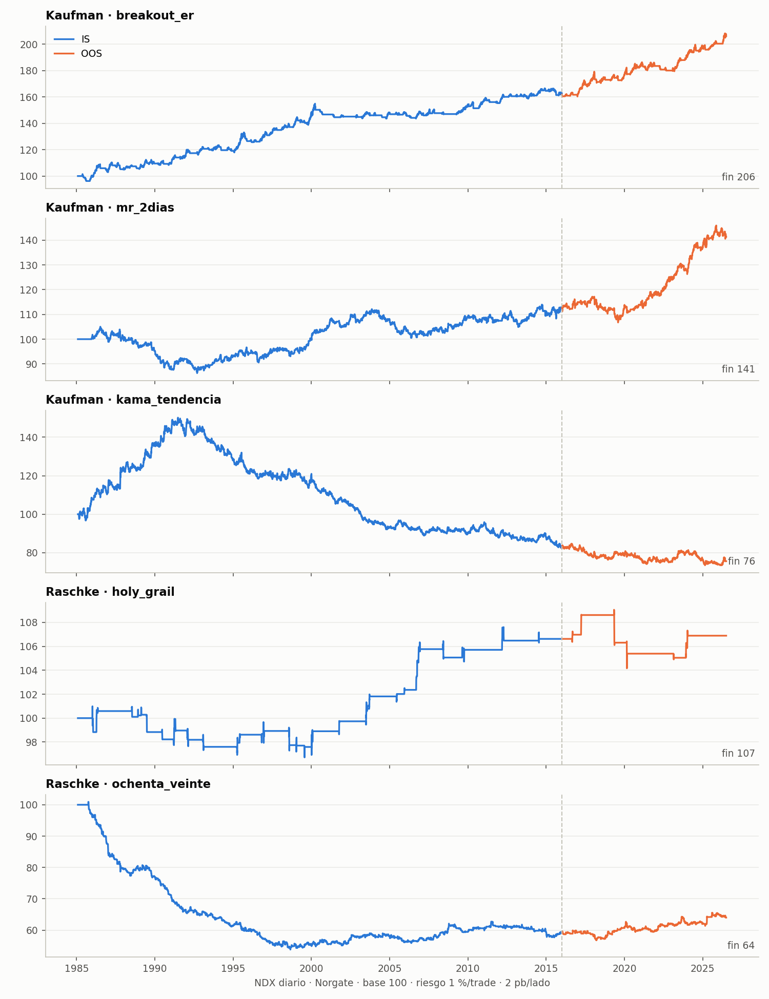
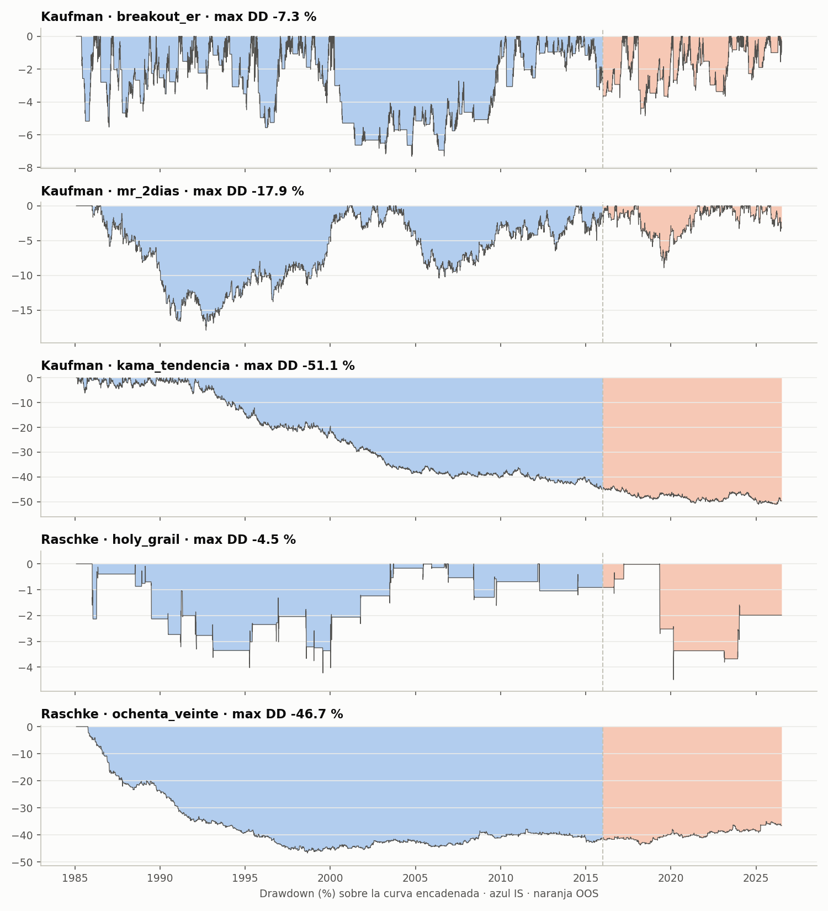
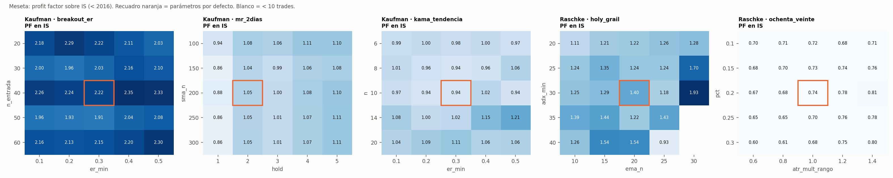
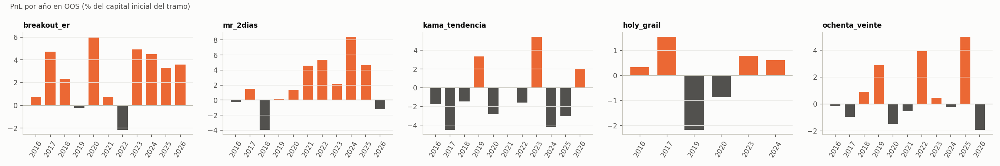

# Backtests Kaufman y Raschke sobre NDX — reporte visual

Setup común: NDX diario Norgate (1985-01-31 → 2026-07-02), IS < 2016-01-01, OOS ≥ 2016-01-01, coste 2 pb por lado, riesgo 1 % del equity por trade, stop ATR según cada plan. Parámetros por defecto de cada señal, sin optimizar. Métricas de cada tramo calculadas con su propio capital inicial (100 k).

Veredictos oficiales (5 fases, `reportes/<ID>_*/RESUMEN.md`): **todas DESCARTADAS**. `kama_tendencia` solo tenía validación sintética; aquí se corre en NDX por primera vez y **no** ha pasado por las 5 fases.

## Kaufman

### breakout_er

| métrica | IS | OOS |
|---|---|---|
| n_trades | 93.000 | 24.000 |
| profit_factor | 2.218 | 5.701 |
| pf_sin_mejor | 1.995 | 4.889 |
| win_rate | 0.430 | 0.708 |
| expectancia_R | 0.546 | 1.063 |
| cagr | 0.016 | 0.024 |
| max_dd | -0.073 | -0.048 |
| sharpe | 0.531 | 0.856 |
| mar | 0.216 | 0.499 |
| t_stat | 2.411 | 3.031 |
| trades_anio | 3.007 | 2.292 |
| pct_stop | 0.269 | 0.083 |

### mr_2dias

| métrica | IS | OOS |
|---|---|---|
| n_trades | 948.000 | 282.000 |
| profit_factor | 1.055 | 1.354 |
| pf_sin_mejor | 1.043 | 1.311 |
| win_rate | 0.546 | 0.589 |
| expectancia_R | 0.014 | 0.075 |
| cagr | 0.004 | 0.020 |
| max_dd | -0.179 | -0.089 |
| sharpe | 0.130 | 0.591 |
| mar | 0.021 | 0.222 |
| t_stat | 0.672 | 2.019 |
| trades_anio | 30.647 | 26.928 |
| pct_stop | 0.135 | 0.099 |

### kama_tendencia

| métrica | IS | OOS |
|---|---|---|
| n_trades | 991.000 | 325.000 |
| profit_factor | 0.939 | 0.887 |
| pf_sin_mejor | 0.911 | 0.838 |
| win_rate | 0.375 | 0.418 |
| expectancia_R | -0.016 | -0.025 |
| cagr | -0.006 | -0.009 |
| max_dd | -0.451 | -0.132 |
| sharpe | -0.117 | -0.167 |
| mar | -0.014 | -0.065 |
| t_stat | -0.616 | -0.756 |
| trades_anio | 32.037 | 31.034 |
| pct_stop | 0.040 | 0.062 |

## Raschke

### holy_grail

| métrica | IS | OOS |
|---|---|---|
| n_trades | 64.000 | 13.000 |
| profit_factor | 1.399 | 1.049 |
| pf_sin_mejor | 1.287 | 0.748 |
| win_rate | 0.562 | 0.385 |
| expectancia_R | 0.103 | 0.023 |
| cagr | 0.002 | 0.000 |
| max_dd | -0.042 | -0.045 |
| sharpe | 0.190 | 0.031 |
| mar | 0.049 | 0.005 |
| t_stat | 1.086 | 0.074 |
| trades_anio | 2.069 | 1.241 |
| pct_stop | 0.156 | 0.308 |

### ochenta_veinte

| métrica | IS | OOS |
|---|---|---|
| n_trades | 1153.000 | 276.000 |
| profit_factor | 0.743 | 1.153 |
| pf_sin_mejor | 0.735 | 1.120 |
| win_rate | 0.453 | 0.522 |
| expectancia_R | -0.044 | 0.029 |
| cagr | -0.017 | 0.007 |
| max_dd | -0.467 | -0.052 |
| sharpe | -0.546 | 0.274 |
| mar | -0.036 | 0.139 |
| t_stat | -3.773 | 0.899 |
| trades_anio | 37.275 | 26.355 |
| pct_stop | 0.075 | 0.040 |

## Ficheros

- `metricas.csv` — tabla completa IS/OOS por señal
- `meseta_<senal>.csv` — superficie PF en IS por señal (la del heatmap)
- `equity.png`, `drawdown.png`, `heatmaps.png`, `pnl_anual_oos.png`
